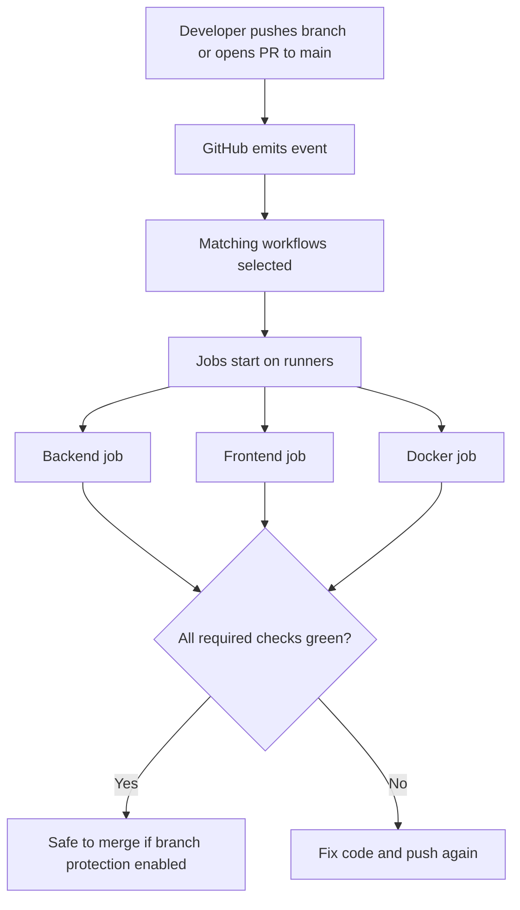

# CI/CD — concepts for this lab

This document explains **continuous integration**, **continuous delivery/deployment**, and how they show up in **GitHub Actions** — at a level that matches Infra Stack Lab today (`.github/workflows/ci.yml`) and where you go next (registry, environments, cluster).

Like [SYSTEM-AND-DOCKER-CONCEPTS.md](./SYSTEM-AND-DOCKER-CONCEPTS.md), each topic uses:

- **In plain terms** — intuition first.
- **Professional language** — words you will see in job postings, design reviews, and runbooks.

---

## Table of contents

1. [Why CI/CD exists](#1-why-cicd-exists)
2. [CI vs CD — two different promises](#2-ci-vs-cd--two-different-promises)
3. [Core vocabulary (GitHub Actions)](#3-core-vocabulary-github-actions)
4. [How a run works end-to-end](#4-how-a-run-works-end-to-end)
5. [What our `ci.yml` actually does](#5-what-our-ciyml-actually-does)
6. [Quality gates: branch protection (Phase E2)](#6-quality-gates-branch-protection-phase-e2)
   - [6.1 What you control in the browser](#61-what-you-control-in-the-browser)
   - [6.2 Rulesets UI: import JSON (recommended on newer GitHub)](#62-rulesets-ui-import-json-recommended-on-newer-github)
   - [6.3 Step-by-step: classic branch protection for `main`](#63-step-by-step-classic-branch-protection-for-main)
   - [6.4 Rule profiles: this lab vs a typical team app](#64-rule-profiles-this-lab-vs-a-typical-team-app)
   - [6.5 Required checks for this repository](#65-required-checks-for-this-repository)
   - [6.6 Verify and common gotchas](#66-verify-and-common-gotchas)
7. [What “strong” CI/CD usually adds next](#7-what-strong-cicd-usually-adds-next)
   - [7.1 GitHub Container Registry (GHCR) — this lab](#71-github-container-registry-ghcr--this-lab)
8. [Relationship to Docker and “the cluster”](#8-relationship-to-docker-and-the-cluster)
9. [Glossary](#9-glossary)

---

## 1. Why CI/CD exists

**In plain terms:**  
Humans forget steps, machines do not. After you push code, you want an **automatic double-check**: tests pass, lint is clean, the app still builds — **before** that code becomes “the truth” on `main` or on a server.

**Professional language:**  
CI/CD reduces **lead time** and **change failure rate** (DORA metrics) by automating verification and repeatable releases. It turns “works on my laptop” into **evidence** on a clean machine (the **runner**).

---

## 2. CI vs CD — two different promises

| Idea | In plain terms | Professional language |
|------|----------------|------------------------|
| **CI (Continuous Integration)** | Every time someone merges or opens a PR, the repo is **integrated** and **verified**: install deps, lint, test, often build artifacts or images. | **Fast feedback** on integration risk; catches regressions early. |
| **CD — Continuous *Delivery*** | Main is **always deployable**: build release artifacts; deploy to staging/production may be **manual approval**. | **Release readiness** without forcing automatic production deploy. |
| **CD — Continuous *Deployment*** | Every merge to main **automatically goes to production** (with strong tests and feature flags). | Highest automation; needs mature tests and observability. |

**Where this lab is today**

- **CI:** yes — automated checks in GitHub Actions ([`ci.yml`](../.github/workflows/ci.yml)).
- **CD:** not wired in this repo yet — no automatic push of images to a registry, no deploy to a VM/Kubernetes environment. That is the **next learning arc** (roadmap Phase F2+).

So it is normal that your pipeline feels “light”: you have built **integration verification first**, which is the right foundation.

---

## 3. Core vocabulary (GitHub Actions)

### Workflow

**In plain terms:**  
A YAML file under `.github/workflows/` that says **when** something runs and **what** steps to run.

**Professional language:**  
Declarative **pipeline as code**, versioned with the application.

### Trigger (`on:`)

**In plain terms:**  
Rules like “run when there is a push to `main`” or “when a PR targets `main`.”

**Professional language:**  
**Event-driven automation** tied to Git refs and GitHub events.

### Job

**In plain terms:**  
A named block of work that runs on **one** machine at a time unless you parallelize across jobs.

**Professional language:**  
An isolated **stage** with its own runner; jobs run in parallel by default (unless you use `needs:`).

### Step

**In plain terms:**  
One instruction inside a job: checkout code, install Node, run `npm test`, etc.

**Professional language:**  
Atomic **task** within a job; steps share the job’s filesystem unless you use separate jobs.

### Runner

**In plain terms:**  
The machine where GitHub runs your workflow — usually **GitHub-hosted** (`ubuntu-latest`), or your own **self-hosted** runner.

**Professional language:**  
**Ephemeral compute** for CI; should not hold long-lived secrets except via GitHub **Secrets** / OIDC patterns.

### Action (`uses:`)

**In plain terms:**  
A reusable bundle of steps maintained by GitHub or the community (e.g. `actions/checkout`, `actions/setup-node`).

**Professional language:**  
**Composable automation module** — reduces YAML duplication.

### Cache

**In plain terms:**  
Save downloaded packages (`npm`, `uv`) between runs so CI is faster.

**Professional language:**  
**Artifact reuse** keyed by lockfiles; speeds up feedback loops.

### Artifact vs container image

**In plain terms:**

- **Artifact:** a zip or file produced by CI (test reports, built `dist/`, binaries) attached to the workflow run.
- **Container image:** the result of `docker build`, usually stored in a **registry** (GHCR, Artifact Registry, ECR).

**Professional language:**  
CI often publishes **immutable release artifacts**; CD consumes them by tag/digest.

---

## 4. How a run works end-to-end

**In plain terms:**  
GitHub catches mistakes **before** they land on `main` — if you turn on branch protection.

**Professional language:**  
Shift-left validation; reduces **escaped defects** and production incidents.

---

## 5. What our `ci.yml` actually does

File: [`.github/workflows/ci.yml`](../.github/workflows/ci.yml).

| Section | Meaning |
|---------|---------|
| **`name: CI`** | Display name in the Actions tab. |
| **`on: push / pull_request` for `main`** | Run when code lands on `main` or when someone opens/updates a PR against `main`. |
| **`permissions: contents: read`** | Workflow may read the repo only — good default security. |
| **`concurrency`** | Avoid pile-ups: newer commits cancel older runs on the same branch where configured. |
| **`backend` job** | Uses **uv** to install locked deps (`uv sync --frozen`), runs **Ruff** (lint) and **pytest** (tests) under `apps/backend`. |
| **`frontend` job** | Uses **Node 20**, `npm ci`, **ESLint**, **`npm run build`** under `apps/frontend`. |
| **`docker` job** | Runs `docker build` for API and UI Dockerfiles from the **lab root** — proves images **still build** after changes. |

**Important:** this pipeline **does not deploy** anywhere and **does not push** images to a registry yet. That is deliberate for an early lab: **verify quality first**, then add **delivery**.

---

## 6. Quality gates: branch protection (Phase E2)

**In plain terms:**  
CI can run and still be ignored unless GitHub **blocks merges** when checks fail.

**Professional language:**  
**Governance**: protected branches + required status checks enforce **definition of done** for `main`.

Until you turn this on, CI is **advisory**. After this, CI becomes **mandatory** for merges (for everyone you did not exempt).

---

### 6.1 What you control in the browser

Branch protection is **only** changed in **GitHub** (repository **Settings**, or an **organization policy** above the repo). No amount of YAML in the repo can *force* protection by itself — you (or an org admin) must enable it once.

**Direct link pattern** (replace if your owner/repo differs):

`https://github.com/<owner>/<repo>/settings/branches`

For this lab: `https://github.com/zubair-autometa/Infra-Stack-Lab/settings/branches`

**Rulesets (newer UI):** `https://github.com/zubair-autometa/Infra-Stack-Lab/settings/rules`

---

### 6.2 Rulesets UI: import JSON (recommended on newer GitHub)

You are in the right place when the URL is **`/settings/rules`** and the page title is **Rulesets**.

1. Open **Settings** → **Rules** → **Rulesets** (or go straight to `https://github.com/<owner>/<repo>/settings/rules`).
2. Click **New ruleset** → **Import a ruleset** (not “New branch ruleset” unless you prefer clicking each toggle by hand).
3. Choose the file **[`.github/rulesets/main-branch-infra-stack-lab.json`](../.github/rulesets/main-branch-infra-stack-lab.json)** from your cloned repo (or download that file from GitHub after you pull latest `main`).
4. GitHub opens a **preview** of the ruleset. Confirm:
   - **Target branches** includes **`main`** (the JSON uses `refs/heads/main`).
   - **Enforcement** is **Active** (not “Evaluate only”).
5. Click **Create** / **Save**.

**What that JSON contains (field by field):**

| JSON field | Meaning |
|------------|---------|
| `name` | Human-readable ruleset name in the GitHub UI. |
| `target`: `branch` | This ruleset applies to **branches**, not tags. |
| `source_type`: `Repository` | The ruleset is owned by this repository. |
| `enforcement`: `active` | Rules are **enforced** (not dry-run). |
| `conditions.ref_name.include` | Which refs match — here **`refs/heads/main`** only. |
| `rules[].type`: `deletion` | Prevents deleting the **`main`** branch without bypass permission. |
| `rules[].type`: `non_fast_forward` | Blocks **force-push** (rewriting history) on matching refs. |
| `rules[].type`: `pull_request` | Changes must land via **pull request** (no direct push merge to `main` in normal flow). `required_approving_review_count: 0` = solo-friendly (no reviewer required). |
| `rules[].type`: `required_status_checks` | Lists **status check contexts** that must be green before the branch can move forward (here: your three CI jobs). |
| `parameters.do_not_enforce_on_create` | When `true`, avoids edge cases when the branch is first created. |
| `parameters.strict_required_status_checks_policy` | `false` = **loose**: PR does not have to merge latest `main` before merge (fewer rebuilds). Set `true` for **strict** “up to date before merge”. |

More detail and troubleshooting: **[`.github/rulesets/README.md`](../.github/rulesets/README.md)**.

If import fails with a validation error, use **New branch ruleset** and mirror the same ideas manually, or compare your check names to a green **Actions** run ([§6.5](#65-required-checks-for-this-repository)).

---

### 6.3 Step-by-step: classic branch protection for `main`

These steps match the common **“Branch protection rules”** UI (wording can shift slightly as GitHub updates).

1. **Open the repo on GitHub** (logged in as someone with **Admin** on the repo).
2. Go to **Settings** (repo tabs: Code, Issues, **Settings**).
3. In the left sidebar, click **Branches** (under “Code and automation”).
4. Under **Branch protection rules**, click **Add branch protection rule** (or **Add rule**).
5. **Branch name pattern:** type exactly **`main`** (unless your default branch has another name — then use that name).
6. Enable the rules you want from the table in [§6.4](#64-rule-profiles-this-lab-vs-a-typical-team-app) (start with the **“This lab (recommended now)”** column).
7. Under **Protect matching branches** → find **Require status checks to pass before merging**:
   - Turn it **on**.
   - Click **Add checks** / search box.
   - Add the checks listed in [§6.5](#65-required-checks-for-this-repository).  
     If a check **does not appear**, open **Actions**, confirm the latest **CI** workflow on `main` is **green**; GitHub only lists checks it has seen succeed at least once.
8. Click **Create** or **Save changes** at the bottom of the page.

---

### 6.4 Rule profiles: this lab vs a typical team app

Not every company uses the same switches. Below is what is **common** and what makes sense for **you learning** vs a **production multi-developer** app.

| Rule (as labeled in GitHub UI) | This lab (recommended now) | Typical team / production app |
|----------------------------------|----------------------------|-------------------------------|
| **Require a pull request before merging** | **On** — you practice real flow; merge only via PR into `main`. | **On** — almost always. |
| **Required approvals** (under PR requirements) | **0** if you are solo (PR still documents the change); **1** if two+ people. | **1–2** depending on risk (money-moving, regulated, etc.). |
| **Dismiss stale pull request approvals when new commits are pushed** | Optional **On** once you have reviewers. | Often **On** so re-review happens after changes. |
| **Require review from Code Owners** | Off until you add `CODEOWNERS`. | On for sensitive paths when you adopt CODEOWNERS. |
| **Require status checks to pass before merging** | **On** — wire to **CI** jobs ([§6.5](#65-required-checks-for-this-repository)). | **On** — CI + extra checks (security, contract tests) as you grow. |
| **Require branches to be up to date before merging** | Optional **On** — stricter; every merge rebases on latest `main`. | Often **On** on busy repos to catch integration issues. |
| **Require conversation resolution before merging** | Optional. | Common when reviews use threads. |
| **Require signed commits** | Off while learning (GPG/SSH signing setup). | Some orgs **On** for compliance. |
| **Require linear history** | Optional (often paired with **Squash merge** only). | Team style choice. |
| **Require deployments to succeed** | Off until you have **Environments** + deploy workflows. | On for gated **staging/prod** deploys. |
| **Lock branch** | Off (would block all writes). | Rare; emergency freeze only. |
| **Do not allow bypassing the above settings** | Your choice: **Off** = admins can merge if CI is red (escape hatch); **On** = nobody skips rules. | Production: often **On**; learning solo sometimes **Off**. |
| **Allow force pushes** | **Off** — keeps history on `main` trustworthy. | **Off** almost always. |
| **Allow deletions** | **Off** — prevents accidental branch delete. | **Off** for `main`. |

**Reality check:** “Every application” does **not** use identical toggles — regulated finance, a mobile game, and an internal admin tool differ. The **constant** is: **default branch is protected**, **CI required**, **no force-push to main**, **changes land via PR** once more than one person touches the code.

---

### 6.5 Required checks for this repository

Your workflow file is [`.github/workflows/ci.yml`](../.github/workflows/ci.yml). Each **job** has a `name:` that becomes a **check** in the PR UI.

Add **all three** as required status checks:

1. **`Backend (ruff + pytest)`** — from `jobs.backend.name`
2. **`Frontend (eslint + build)`** — from `jobs.frontend.name`
3. **`Docker (API + UI images)`** — from `jobs.docker.name`

If GitHub shows a slightly different string (for example prefixed with workflow name), pick the entries that clearly match those three jobs from the latest green **CI** run.

---

### 6.6 Verify and common gotchas

**Verify**

1. Open a **test PR** (small doc typo is fine).
2. Confirm all three checks appear and run.
3. Try to **merge while checks are running** — merge button should be disabled or warn until green.
4. (Optional) Push a commit that **breaks tests** on purpose on the PR branch — merge should stay blocked until fixed.

**Gotchas**

- **Checks not listed** when adding rules → run **CI successfully on `main` at least once** after the workflow exists.
- **Required check name mismatch** → open **Actions → latest run → job sidebar** and copy the exact check name GitHub shows.
- **You bypass protection** → you may be **admin** with “allow bypass” still enabled; see table in §6.4.
- **Pushing directly to `main`** → with “Require PR before merging” on, GitHub blocks **direct pushes** to `main`; you must use a **branch + PR** (that is intended).

---

## 7. What “strong” CI/CD usually adds next

Roughly in the order teams adopt them:

1. **Secrets scanning** — detect committed keys (GitHub Advanced Security or open tools).
2. **Dependency audit** — `npm audit`, SBOM, Dependabot.
3. **Image scanning** — scan Docker images for CVEs before deploy.
4. **Publish images** — tag with **git SHA**, push to **GHCR** or cloud registry. **This repo:** see [§7.1](#71-github-container-registry-ghcr--this-lab).
5. **Environments** — `test`, `staging`, `production` with **approval gates**.
6. **Deploy** — Kubernetes, Cloud Run, VMs — using **OIDC to cloud** (no long-lived cloud keys in GitHub).
7. **Smoke tests after deploy** — hit `/health`, one authenticated path.

Your roadmap (`LEARNING-ROADMAP.md`) maps these to **Phase F** (CI/CD) and **Phase G/H** (GCP + Kubernetes).

### 7.1 GitHub Container Registry (GHCR) — this lab

**In plain terms:** After your **CI** workflow succeeds on a **push** to **`main`**, a second workflow **[`publish-images.yml`](../.github/workflows/publish-images.yml)** builds the same two Docker images again and **uploads** them to **GitHub Container Registry** (`ghcr.io`). Tags include **`latest`** and the **full git commit SHA** so you can pin exactly what was built.

**Professional language:** This is **continuous delivery** of **immutable artifacts**: the SHA tag is the promotion unit; `latest` is a convenience pointer that moves on each merge.

**Why `workflow_run` instead of only `push`?** The publish job starts only after the **`CI`** workflow completes **successfully**, and only when that CI run was triggered by a **`push`** to **`main`** (so a green PR does not publish until it is merged). The checkout uses **`head_sha`** from that CI run so the image matches the tested commit.

**Image names (replace `OWNER` with your GitHub user or org, e.g. `zubair-autometa`):**

- `ghcr.io/OWNER/infra-stack-lab-api:SHA` and `:latest`
- `ghcr.io/OWNER/infra-stack-lab-frontend:SHA` and `:latest`

**Pull auth:** New packages are often **private**. To pull from your laptop: **Package settings → Manage Actions access** / visibility, or `docker login ghcr.io` with a token that has **`read:packages`**. For public learning demos, you can set each package to **Public** in its settings.

**Not done yet (next slices of F):** deploy those images to a **test** VM or cluster, smoke-test `/health`, and add **GitHub Environments** with optional **approval** before production.

---

## 8. Relationship to Docker and “the cluster”

**In plain terms:**

- **Dockerfile / Compose** = how the app runs **as containers** on your machine.
- **CI `docker build`** = proof those containers **still build** in a clean environment.
- **Cluster (e.g. Kubernetes)** = where those **same images** run in production — scheduled, scaled, restarted.

**Professional language:**  
The **image** is the portable unit; CI proves **buildability**; CD **promotes immutable tags**; the cluster **orchestrates** workloads (Deployments, Services, Ingress).

You move to the cluster **after** you trust your pipeline and image promotion story — otherwise you automate broken deployments faster.

---

## 9. Glossary

| Term | Meaning |
|------|---------|
| **Pipeline / workflow** | Automated sequence triggered by Git events. |
| **Lint** | Static rules that catch style and obvious bugs without running full integration. |
| **Test** | Executable proof that behavior matches expectations (unit/integration). |
| **Build** | Produce runnable output (frontend bundle, backend package, Docker image). |
| **Registry** | Storage for container images (GHCR, GCR, ECR). |
| **Promotion** | Moving a **tested** artifact from dev → test → prod by tag or digest. |
| **Rollback** | Deploying the **previous known-good** image/tag when something fails. |

---

## Further reading in this repo

- **[LEARNING-ROADMAP.md](../LEARNING-ROADMAP.md)** — phases E/F and full learning sequence.
- **[SYSTEM-AND-DOCKER-CONCEPTS.md](./SYSTEM-AND-DOCKER-CONCEPTS.md)** — how Compose and services fit together (runtime).
- **Handbook file `05-cicd-github-actions.md`** (in `devops-handbook`) — deeper theory when you read alongside this lab.

---

*Last updated with the Infra Stack Lab CI workflow (`ci.yml`): lint, test, Docker build verification.*
