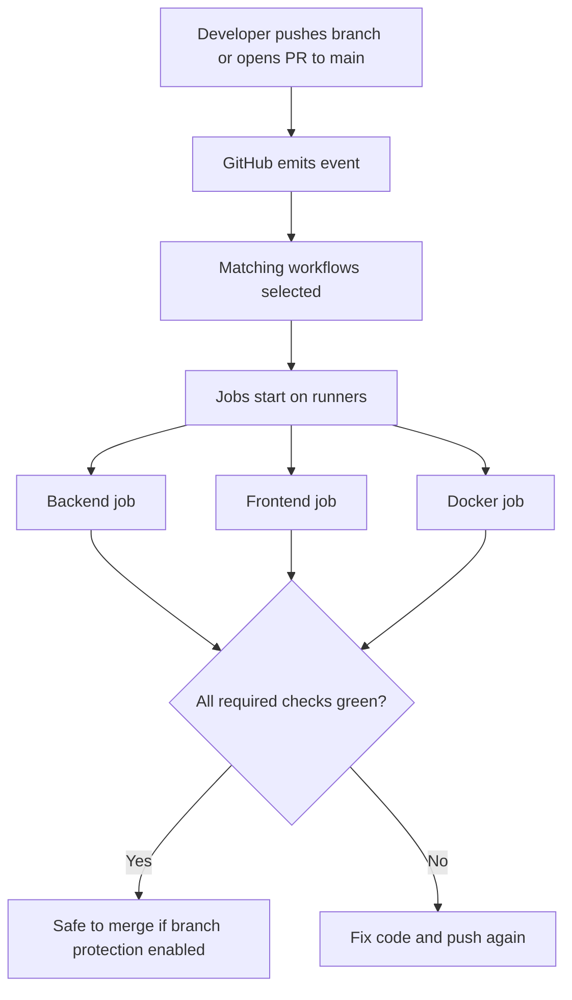

# CI/CD — concepts for this lab

This document explains **continuous integration**, **continuous delivery/deployment**, and how they show up in **GitHub Actions** — at a level that matches Infra Stack Lab today (`.github/workflows/ci.yml`) and where you go next (registry, environments, cluster).

Like [SYSTEM-AND-DOCKER-CONCEPTS.md](./SYSTEM-AND-DOCKER-CONCEPTS.md), each topic uses:

- **In plain terms** — intuition first.
- **Professional language** — words you will see in job postings, design reviews, and runbooks.

---

## Table of contents

1. [Why CI/CD exists](#1-why-cicd-exists)
2. [CI vs CD — two different promises](#2-ci-vs-cd--two-different-promises)
3. [Core vocabulary (GitHub Actions)](#3-core-vocabulary-github-actions)
4. [How a run works end-to-end](#4-how-a-run-works-end-to-end)
5. [What our `ci.yml` actually does](#5-what-our-ciyml-actually-does)
6. [Quality gates: branch protection (Phase E2)](#6-quality-gates-branch-protection-phase-e2)
7. [What “strong” CI/CD usually adds next](#7-what-strong-cicd-usually-adds-next)
8. [Relationship to Docker and “the cluster”](#8-relationship-to-docker-and-the-cluster)
9. [Glossary](#9-glossary)

---

## 1. Why CI/CD exists

**In plain terms:**  
Humans forget steps, machines do not. After you push code, you want an **automatic double-check**: tests pass, lint is clean, the app still builds — **before** that code becomes “the truth” on `main` or on a server.

**Professional language:**  
CI/CD reduces **lead time** and **change failure rate** (DORA metrics) by automating verification and repeatable releases. It turns “works on my laptop” into **evidence** on a clean machine (the **runner**).

---

## 2. CI vs CD — two different promises

| Idea | In plain terms | Professional language |
|------|----------------|------------------------|
| **CI (Continuous Integration)** | Every time someone merges or opens a PR, the repo is **integrated** and **verified**: install deps, lint, test, often build artifacts or images. | **Fast feedback** on integration risk; catches regressions early. |
| **CD — Continuous *Delivery*** | Main is **always deployable**: build release artifacts; deploy to staging/production may be **manual approval**. | **Release readiness** without forcing automatic production deploy. |
| **CD — Continuous *Deployment*** | Every merge to main **automatically goes to production** (with strong tests and feature flags). | Highest automation; needs mature tests and observability. |

**Where this lab is today**

- **CI:** yes — automated checks in GitHub Actions ([`ci.yml`](../.github/workflows/ci.yml)).
- **CD:** not wired in this repo yet — no automatic push of images to a registry, no deploy to a VM/Kubernetes environment. That is the **next learning arc** (roadmap Phase F2+).

So it is normal that your pipeline feels “light”: you have built **integration verification first**, which is the right foundation.

---

## 3. Core vocabulary (GitHub Actions)

### Workflow

**In plain terms:**  
A YAML file under `.github/workflows/` that says **when** something runs and **what** steps to run.

**Professional language:**  
Declarative **pipeline as code**, versioned with the application.

### Trigger (`on:`)

**In plain terms:**  
Rules like “run when there is a push to `main`” or “when a PR targets `main`.”

**Professional language:**  
**Event-driven automation** tied to Git refs and GitHub events.

### Job

**In plain terms:**  
A named block of work that runs on **one** machine at a time unless you parallelize across jobs.

**Professional language:**  
An isolated **stage** with its own runner; jobs run in parallel by default (unless you use `needs:`).

### Step

**In plain terms:**  
One instruction inside a job: checkout code, install Node, run `npm test`, etc.

**Professional language:**  
Atomic **task** within a job; steps share the job’s filesystem unless you use separate jobs.

### Runner

**In plain terms:**  
The machine where GitHub runs your workflow — usually **GitHub-hosted** (`ubuntu-latest`), or your own **self-hosted** runner.

**Professional language:**  
**Ephemeral compute** for CI; should not hold long-lived secrets except via GitHub **Secrets** / OIDC patterns.

### Action (`uses:`)

**In plain terms:**  
A reusable bundle of steps maintained by GitHub or the community (e.g. `actions/checkout`, `actions/setup-node`).

**Professional language:**  
**Composable automation module** — reduces YAML duplication.

### Cache

**In plain terms:**  
Save downloaded packages (`npm`, `uv`) between runs so CI is faster.

**Professional language:**  
**Artifact reuse** keyed by lockfiles; speeds up feedback loops.

### Artifact vs container image

**In plain terms:**

- **Artifact:** a zip or file produced by CI (test reports, built `dist/`, binaries) attached to the workflow run.
- **Container image:** the result of `docker build`, usually stored in a **registry** (GHCR, Artifact Registry, ECR).

**Professional language:**  
CI often publishes **immutable release artifacts**; CD consumes them by tag/digest.

---

## 4. How a run works end-to-end

**In plain terms:**  
GitHub catches mistakes **before** they land on `main` — if you turn on branch protection.

**Professional language:**  
Shift-left validation; reduces **escaped defects** and production incidents.

---

## 5. What our `ci.yml` actually does

File: [`.github/workflows/ci.yml`](../.github/workflows/ci.yml).

| Section | Meaning |
|---------|---------|
| **`name: CI`** | Display name in the Actions tab. |
| **`on: push / pull_request` for `main`** | Run when code lands on `main` or when someone opens/updates a PR against `main`. |
| **`permissions: contents: read`** | Workflow may read the repo only — good default security. |
| **`concurrency`** | Avoid pile-ups: newer commits cancel older runs on the same branch where configured. |
| **`backend` job** | Uses **uv** to install locked deps (`uv sync --frozen`), runs **Ruff** (lint) and **pytest** (tests) under `apps/backend`. |
| **`frontend` job** | Uses **Node 20**, `npm ci`, **ESLint**, **`npm run build`** under `apps/frontend`. |
| **`docker` job** | Runs `docker build` for API and UI Dockerfiles from the **lab root** — proves images **still build** after changes. |

**Important:** this pipeline **does not deploy** anywhere and **does not push** images to a registry yet. That is deliberate for an early lab: **verify quality first**, then add **delivery**.

---

## 6. Quality gates: branch protection (Phase E2)

**In plain terms:**  
CI can run and still be ignored unless GitHub **blocks merges** when checks fail.

**Professional language:**  
**Governance**: protected branches + required status checks enforce **definition of done** for `main`.

**Manual steps (once per repo):**

1. Repository **Settings → Branches → Branch protection rule** for `main`.
2. Enable **Require status checks to pass before merging**.
3. Select job names from your workflow (they appear after at least one successful run).

Until you do this, CI is **advisory**. After this, CI becomes **mandatory** for merges — closer to real teams.

---

## 7. What “strong” CI/CD usually adds next

Roughly in the order teams adopt them:

1. **Secrets scanning** — detect committed keys (GitHub Advanced Security or open tools).
2. **Dependency audit** — `npm audit`, SBOM, Dependabot.
3. **Image scanning** — scan Docker images for CVEs before deploy.
4. **Publish images** — tag with **git SHA**, push to **GHCR** or cloud registry.
5. **Environments** — `test`, `staging`, `production` with **approval gates**.
6. **Deploy** — Kubernetes, Cloud Run, VMs — using **OIDC to cloud** (no long-lived cloud keys in GitHub).
7. **Smoke tests after deploy** — hit `/health`, one authenticated path.

Your roadmap (`LEARNING-ROADMAP.md`) maps these to **Phase F** (CI/CD) and **Phase G/H** (GCP + Kubernetes).

---

## 8. Relationship to Docker and “the cluster”

**In plain terms:**

- **Dockerfile / Compose** = how the app runs **as containers** on your machine.
- **CI `docker build`** = proof those containers **still build** in a clean environment.
- **Cluster (e.g. Kubernetes)** = where those **same images** run in production — scheduled, scaled, restarted.

**Professional language:**  
The **image** is the portable unit; CI proves **buildability**; CD **promotes immutable tags**; the cluster **orchestrates** workloads (Deployments, Services, Ingress).

You move to the cluster **after** you trust your pipeline and image promotion story — otherwise you automate broken deployments faster.

---

## 9. Glossary

| Term | Meaning |
|------|---------|
| **Pipeline / workflow** | Automated sequence triggered by Git events. |
| **Lint** | Static rules that catch style and obvious bugs without running full integration. |
| **Test** | Executable proof that behavior matches expectations (unit/integration). |
| **Build** | Produce runnable output (frontend bundle, backend package, Docker image). |
| **Registry** | Storage for container images (GHCR, GCR, ECR). |
| **Promotion** | Moving a **tested** artifact from dev → test → prod by tag or digest. |
| **Rollback** | Deploying the **previous known-good** image/tag when something fails. |

---

## Further reading in this repo

- **[LEARNING-ROADMAP.md](../LEARNING-ROADMAP.md)** — phases E/F and full learning sequence.
- **[SYSTEM-AND-DOCKER-CONCEPTS.md](./SYSTEM-AND-DOCKER-CONCEPTS.md)** — how Compose and services fit together (runtime).
- **Handbook file `05-cicd-github-actions.md`** (in `devops-handbook`) — deeper theory when you read alongside this lab.

---

*Last updated with the Infra Stack Lab CI workflow (`ci.yml`): lint, test, Docker build verification.*
